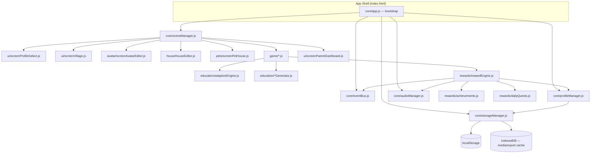
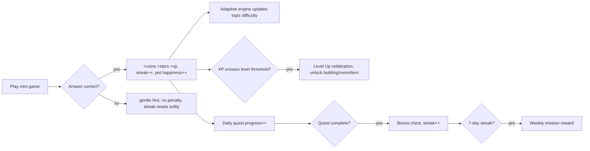

# The Sisters' Dream Town — Project Plan & Architecture

A production-quality, offline-first educational PWA starring **Hirra (12)**, **Amal Zahra (7)** and
**Meezab Rahma (5)** as the magical caretakers of Dream Town. Every learning activity restores magic
to the town, unlocking buildings, pets, decorations and story moments.

This document is the single source of truth for architecture, data schema, progression design and the
delivery roadmap. It is written first, per the project brief, and implementation follows it module by
module.

---

## 1. System Architecture

Pure client-side SPA. No backend, no build step required (native ES Modules), installable as a PWA,
fully functional offline after first load.



**Key principles**

- **Event-driven, not tightly coupled.** Every module talks through `core/eventBus.js`. A mini-game
  never imports `rewardEngine` UI code directly — it emits `game:answered`, `game:completed`, etc.
  and listeners react. This keeps modules replaceable and testable.
- **Single source of truth per profile.** `core/gameState.js` holds the active profile in memory;
  every mutation goes through `profileManager.mutate()` which patches state, autosaves, and emits
  `profile:changed`.
- **Data-driven content.** Question banks, house catalog, avatar catalog, pet catalog and the village
  map are plain data modules in `/data`, `/questions`. Adding a new item/question/building never
  touches engine code.
- **Progressive enhancement.** Core loop works with keyboard, mouse, or touch. Voice/TTS and sound
  are optional layers that degrade gracefully.

---

## 2. Folder Structure

```
/assets
  /images        decorative SVG/PNG (lazy-loaded, most art is inline SVG — see §9)
  /audio         (reserved — current build synthesizes SFX via WebAudio, no files needed)
  /fonts         (reserved — system font stack used by default, see css/variables.css)
/css
  variables.css  design tokens (color, spacing, radius, shadow, motion)
  base.css       reset, typography, layout primitives
  components.css buttons, cards, modals, meters, chips
  animations.css keyframes, reward FX, celebration screen
  screens.css    per-screen layout (village, house, avatar, minigames, dashboard)
  responsive.css tablet/desktop/mobile breakpoints, landscape/portrait
/js
  core/          bootstrap, event bus, storage, profile manager, scene router, audio
  ui/            shared UI: screens, toast, modal, reward popup, HUD
  game/          mini-game controllers (one file per building experience)
  education/     adaptive difficulty engine + question/content generators
  avatar/        avatar catalog + SVG renderer + editor screen
  house/         furniture catalog + drag/drop/rotate/resize editor
  pets/          pet catalog + happiness/feeding logic + pet house screen
  rewards/       reward economy, achievements, daily/weekly quests
  storage/       low-level storage adapters (localStorage + IndexedDB)
/data            village map, curriculum reference tables, avatar/house/pet catalogs
/questions       per-subject question generators' static content banks
/profiles        (runtime-created; ships empty — profiles live in browser storage)
/icons           PWA icons (SVG, scalable) + favicon
index.html
manifest.json
service-worker.js
```

Everything is native ES Modules (`<script type="module">`), so there is no bundler dependency and the
app can be served as static files.

---

## 3. UI/UX Wireframes

### 3.1 Profile Select (entry screen)

```
┌─────────────────────────────────────────────────────────┐
│                 ✨ The Sisters' Dream Town ✨            │
│                                                           │
│   ┌───────────┐   ┌───────────┐   ┌───────────┐          │
│   │  (avatar) │   │  (avatar) │   │  (avatar) │  [+ Add] │
│   │  Meezab   │   │   Amal    │   │   Hirra   │          │
│   │  Lv.3 ⭐12│   │  Lv.5 ⭐30│   │ Lv.8 ⭐70 │          │
│   └───────────┘   └───────────┘   └───────────┘          │
│                                                           │
│                         [Parent Dashboard 🔒]            │
└─────────────────────────────────────────────────────────┘
```

### 3.2 Village Hub (main world map)

```
┌─────────────────────────────────────────────────────────┐
│ 🪙 120  ⭐ 34  💎 2      Lv.5 ▓▓▓▓▓▓░░░░ 340/500   ⚙ 🔊 │
│                                                           │
│      🏰            📚            🍰            🎨        │
│  Math Castle   Magic Library    Bakery*      Art Studio*  │
│                                                           │
│  🏠            🐾            💻            🕳️            │
│  My Home    Pet House    Typing Cafe   Treasure Cave      │
│                                                           │
│  🌳            💃            🔬*           🏝️*            │
│ Word Forest   Boutique    Science Lab*  Adventure Isle*   │
│                                                           │
│              [Daily Quests 📜 3/5]  [Avatar 🧑]           │
└─────────────────────────────────────────────────────────┘   (* = future phase, shown as "coming soon")
```

Village is a responsive tile grid on mobile/portrait, a scaled illustrated map (absolute-positioned
building nodes on an SVG background) on tablet/desktop landscape.

### 3.3 Mini-game screen (generic template)

```
┌─────────────────────────────────────────────────────────┐
│  ← Back        Math Castle             🪙+2  streak 🔥3  │
│                                                           │
│              ┌─────────────────────────┐                 │
│              │      7  +  5  =  ?      │                 │
│              └─────────────────────────┘                 │
│                                                           │
│        [ 11 ]     [ 12 ]     [ 13 ]     [ 10 ]            │
│                                                           │
│  progress ▓▓▓▓▓▓▓▓░░░░░░  6/10                            │
└─────────────────────────────────────────────────────────┘
```

### 3.4 House Editor

```
┌─────────────────────────────────────────────────────────┐
│  ← Back    My Home         [Rooms ▾] [Save ✓]            │
│ ┌───────────────────────────────────┐  Catalog           │
│ │                                   │  🛏 Beds            │
│ │        drag/drop room canvas      │  🛋 Sofas           │
│ │        (grid snapping, layers)    │  🪟 Curtains        │
│ │                                   │  🌱 Plants          │
│ └───────────────────────────────────┘  ...                │
│   [Rotate ⟲] [Scale −/+] [Delete 🗑]                       │
└─────────────────────────────────────────────────────────┘
```

### 3.5 Parent Dashboard

```
┌─────────────────────────────────────────────────────────┐
│  🔒 PIN verified — Family Reports          [Export ⬇]    │
│  Profile: [Hirra ▾]                                      │
│  Play time today: 24m   Learning time: 19m   Streak: 6🔥 │
│  Math accuracy  ▓▓▓▓▓▓▓▓░░ 82%     Typing: 28 WPM / 94%  │
│  Weak topics: fractions, prefixes                        │
│  Strong topics: multiplication, geography                │
│  [ bar chart: minutes learned per day, last 14 days ]    │
└─────────────────────────────────────────────────────────┘
```

---

## 4. Storage Schema

Two localStorage-backed stores (IndexedDB reserved for future large-media/export caching, wired via
`js/storage/idbAdapter.js`).

```
localStorage["dreamtown:family"] = {
  pinHash: string | null,        // simple salted hash, deterrent-only (not a security boundary)
  profileIds: string[],
  createdAt: ISODate
}

localStorage["dreamtown:profile:<id>"] = {
  id, name, age, ageGroup,              // '5' | '7' | '12'
  createdAt, lastPlayedAt,
  currency: { coins, stars, diamonds },
  xp, level,
  avatar: { skin, hairStyle, hairColor, eyes, outfit, shoes,
            hat, glasses, bag, accessories: [] },
  wardrobe: { owned: string[], equipped: {...same keys as avatar} },
  house: { rooms: { livingRoom: { wallpaper, flooring, placed: [
              { itemId, x, y, rotation, scale, layer }
           ]}, ... }, unlockedRooms: string[] },
  pets: { owned: [{ id, petId, name, happiness, level, adoptedAt }], activePetId },
  achievements: { unlocked: string[], progress: { [achId]: number } },
  quests: { daily: { date, tasks: [{id,type,target,progress,done,reward}],
                      completed, streak, lastCompletedDate },
            weekly: { weekKey, tasks: [...], completed } },
  education: { topics: { "math.addition": { difficulty, attempts, correct,
                          avgTimeMs, mastery, lastSeen }, ... } },
  stats: { totalPlayMs, learningMs, sessionsByDay: { "2026-07-15": ms },
           typingBestWpm, typingBestAccuracy, booksRead, wordsLearned },
  settings: { sound, music, voice, highContrast, largeText, reducedMotion }
}
```

`profileManager` is the only module allowed to write these keys. All reads/writes are JSON
serialized, versioned (`schemaVersion`), and migrated on load if the shape is out of date.

---

## 5. State Management Design

- **`core/eventBus.js`** — minimal pub/sub (`on/off/emit`). All cross-module communication flows
  through named events (`profile:changed`, `reward:earned`, `quest:progress`, `scene:enter`, ...).
- **`core/gameState.js`** — in-memory singleton: `{ activeProfileId, currentScene, sessionStartedAt }`.
  Never persisted directly; derived from `profileManager` + `sceneManager`.
- **`core/profileManager.js`** — CRUD for profiles + `mutate(id, recipe)` which applies an
  Immer-style patch function, persists via `storageManager`, and emits `profile:changed`. This is the
  **only** write path into profile data — mini-games and screens never touch `localStorage` directly.
- **`core/sceneManager.js`** — swaps the visible screen inside `#app`, manages a lightweight history
  stack for the Back button, and emits `scene:enter` / `scene:leave` so screens can pause timers,
  stop audio, etc.
- Screens are plain functions `render(container, ctx) -> cleanup()`; no framework/vdom needed at this
  scale, which keeps the bundle at zero dependencies and the codebase easy to reason about.

---

## 6. Game Progression System



- **XP & Levels:** `xpForLevel(n) = 50 * n^1.5` (rounded). Leveling up unlocks new village buildings,
  house rooms, and wardrobe tiers — this is the primary "world grows with the child" hook.
- **Mastery, not punishment:** wrong answers never cost coins/stars. They shorten the visible streak
  and trigger a hint; the adaptive engine nudges difficulty down slightly so the next question is
  winnable. This satisfies "never frustrate child, always encourage."
- **Streaks:** in-session answer streaks give escalating coin bonuses (x1 → x1.5 → x2 at 3/6/10
  correct in a row). Daily play streaks (calendar days with ≥1 completed quest) unlock the Lucky
  Wheel and streak-bonus chests.

---

## 7. Reward Economy

| Currency  | Earned from                              | Spent on                                  |
|-----------|-------------------------------------------|--------------------------------------------|
| Coins 🪙  | Every correct answer, quests               | Common furniture, wardrobe, décor          |
| Stars ⭐  | Mini-game completion, mastery milestones   | Rare furniture, pet accessories            |
| Diamonds 💎| Weekly missions, streak bonuses, level-up | Legendary outfits, rare pets, secret rooms |

All rewards flow through **`rewards/rewardEngine.js#award()`**, a single funnel that: updates
currency/xp, rolls for bonus items (mystery chest chance scaled by streak), updates achievement
progress, and emits `reward:earned` so the UI layer (`ui/rewardPopup.js`) can animate coins flying to
the wallet, confetti, and sound — visuals never decide game logic, they only react to it.

Economy is shared globally per child (coins earned in Math Castle spend in the Boutique), per the
brief — there is exactly one wallet per profile, not per building.

---

## 8. Educational Curriculum Mapping by Age

| Subject   | Age 5 (Meezab)                                   | Age 7 (Amal Zahra)                                        | Age 12 (Hirra)                                                       |
|-----------|---------------------------------------------------|-------------------------------------------------------------|-------------------------------------------------------------------------|
| Math      | Counting 1–10, shape ID, +/− within 5 with pictures | +/− within 100, intro multiplication, time (o'clock), money coins, patterns | Multiplication/division, fractions, decimals, percentages, order of ops, word problems |
| Vocabulary| Picture matching, first sight words                | Synonyms/antonyms, sentence completion, word building        | Prefixes/suffixes, homophones, advanced synonyms, contextual meaning     |
| Reading   | 3–5 sentence picture stories, read-aloud (TTS)     | Short stories (80–150 words) + comprehension                | Longer passages (200–400 words), inference questions                    |
| Typing    | Letter/key recognition, finger-color guide         | Word typing, home-row practice                               | Sentence & paragraph typing, WPM/accuracy race                          |
| Science/Geo | Animals, big picture cards                       | Plants, weather, simple experiments, continents               | Solar system, water cycle, countries/capitals/flags, landmarks           |
| Memory/Logic | 4-pair card match                               | 6-pair match, simple maze                                     | 8–10 pair match, pattern & shape logic puzzles                          |
| Coding    | —                                                  | Drag-and-drop move/turn blocks                                | If/loop/repeat block programming challenges                             |

`education/adaptiveEngine.js` uses the age to pick the **starting** difficulty band per topic, then
adjusts continuously from rolling accuracy/time — a fast, accurate 7-year-old can drift into "Age 12"
territory on a specific topic (and vice versa), so the label is a seed, not a ceiling.

---

## 9. Mini-Game Specifications (Phase 1 buildings)

| Building | File | Mechanic | Rewards on completion |
|---|---|---|---|
| 🏰 Math Castle | `game/mathCastle.js` | 10-question adaptive round, multiple choice / numeric input, visual counters for age 5 | coins, xp, streak bonus, topic mastery |
| 🌳 Word Forest | `game/wordForest.js` | vocabulary rounds: picture-match (5), synonym/antonym/sentence (7/12) | coins, xp, "words learned" stat |
| 💻 Typing Cafe | `game/typingCafe.js` | on-screen keyboard highlighting, word/sentence prompts, live WPM+accuracy | coins, xp, WPM leaderboard entry |
| 📚 Magic Library | `game/magicLibrary.js` | story reader (age-scaled length) + 3 comprehension questions, optional TTS narration | coins, xp, "books read" stat |
| 🕳️ Treasure Cave | `game/treasureCave.js` | memory card matching, grid size scales with age | coins, stars, treasure chest item |

Every mini-game shares one **round controller contract**: `startRound(profile) -> {question, onAnswer,
onComplete}`, so new subjects (Bakery/fractions-baking, Science Lab, Art Studio, Coding) can be added
in Phase 2 by implementing the same contract — no engine changes required (see §11 Roadmap).

Buildings visible on the map but not yet implemented (Bakery, Garden, Science Lab, Music Hall,
Treasure decorating extras, Home Decoration Store, Beauty Salon, Art Studio, Animal Farm, Adventure
Island) render as friendly "🔒 Coming soon — unlocks in a future update!" nodes so the world feels
complete and the roadmap is visible in-app.

---

## 10. Component Breakdown

- **Core**: EventBus, StorageManager, ProfileManager, GameState, SceneManager, AudioManager
- **UI shared**: HUD (currency/xp bar), Modal, Toast, RewardPopup (coin-fly/confetti), LevelUpOverlay,
  Loader, VoiceToggle, AccessibilityMenu
- **Avatar**: AvatarCatalog (data), AvatarRenderer (layered inline SVG), AvatarEditorScreen
- **House**: HouseCatalog (data), HouseEditor (pointer-based drag/rotate/scale, grid snap), RoomSwitcher
- **Pets**: PetCatalog (data), PetManager (happiness/feeding), PetHouseScreen, PetWidget (village HUD)
- **Rewards**: RewardEngine, AchievementsRegistry, DailyQuestGenerator, WeeklyMissionGenerator, LuckyWheel
- **Education**: AdaptiveEngine, MathGenerator, VocabularyGenerator, TypingGenerator, ReadingContent,
  MemoryGenerator
- **Game screens**: MathCastle, WordForest, TypingCafe, MagicLibrary, TreasureCave
- **Parent**: PinGate, DashboardScreen, ChartCanvas (lightweight canvas bar/line charts), ExportReport

---

## 11. Development Roadmap

**Phase 1 — Foundation & core loop (this delivery)**
Core engine, storage/profiles, village hub, avatar editor, house editor, pet house, reward economy,
daily quests, achievements, 5 mini-games (Math Castle, Word Forest, Typing Cafe, Magic Library,
Treasure Cave), parent dashboard, accessibility baseline, PWA install + offline cache.

**Phase 2 — World expansion**
Science Lab, Bakery (fractions via recipes), Art Studio (coloring/sticker books), Boutique
(dress-up/fashion mini-game), Home Decoration Store, Music Hall. Weekly missions, lucky wheel,
seasonal festival event.

**Phase 3 — Advanced learning + coding**
Block-based coding building, geometry/tangram puzzles, Sudoku for kids, maze logic, Animal Farm,
Adventure Island exploration map, secret rooms.

**Phase 4 — Expansion languages & socials**
Arabic/Urdu/Islamic Studies/English grammar modules (new `education/*` generators, same contract),
family-only multiplayer (typing races), optional cloud sync adapter behind the existing
`storageManager` interface (swap localStorage adapter for a remote one without touching game code).

---

## 12. Non-Functional Requirements Checklist

- [x] No backend; localStorage + IndexedDB-ready storage layer
- [x] PWA manifest + service worker (cache-first shell, offline after first load)
- [x] Responsive: mobile/tablet/desktop, portrait/landscape
- [x] Touch-first (large targets ≥44px, drag/drop, tap)
- [x] 60fps-targeted CSS transforms/opacity animations, `prefers-reduced-motion` respected
- [x] Accessibility: large text mode, high contrast mode, keyboard navigation, ARIA live regions,
      optional speech synthesis narration
- [x] Zero external JS dependencies (vanilla ES Modules)
